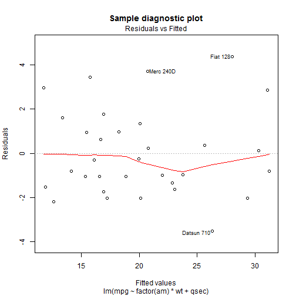

## Quick facts
- Application accessible at [strannik1981.shinyapps.io/devdataprod-007/](strannik1981.shinyapps.io/devdataprod-007/)
- All R code accessible at [https://github.com/strannik1981/devdataprod-007](https://github.com/strannik1981/devdataprod-007)
- Written in R with Shiny web application framework ([http://shiny.rstudio.com/](http://shiny.rstudio.com/))
- Includes inline documentaion
- Based on the [Regression Models course](https://www.coursera.org/course/regmods) final project - using linear regression to explore relationship between *mpg* as response and other variables as predictors in the **mtcars** dataset
- Allows addition of new entries to the standard **mtcars** dataset within a single session
- Automatically creates scatterplots of *mpg* vs predictor variables to aid in exploratory analysis
- Allows interactive assembly of a linear model of *mpg* as response based on the predictor variables themselves, as well as their interaction with the *am* variable
- Automatically creates diagnostic plots of a linear model to evaluate fit and explore possible areas for improvement
- Serves as a good starting point in a more sophisticated analysis, allows to download (augmented) **mtcars** dataset as a CSV file and continue work in a local environment

---

## Behind the scenes

- Additions to the dataset and model builds depend on explicit button clicks associated with the respective input controls
- Generation of exploratory and diagnostic plots is tied to dataset additions and linear model builds - no additional actions required
- New entries are added to the end of the local copy of the **mtcars** dataset
- Uses **ggplot2** library for exploratory analysis - easier, faster, and provide more useful information than using default graphics
- Formula for the linear regression model assembled dynamically based on the selected predictors
- Standard linear model information generated by *print.summary.lm*
- Standard diagnostic plots generated by *plot.lm* function
- All of the stateful variables have session scope - no direct interaction with other users. However, server-side may still be vulnerable to session hijacking

---

## Sample output

 

---

## Areas for improvement

### Features:
- Introduce a function to clear the current dataset
- Introduce a function to import data in a CSV format
- Enable exclusion of individual data entries from modeling
- Enable selection of a polinomial degree of a predictor variable
- Enable selection of a wider range of interaction effects
- Expand diagnostic output

### Code:
- Move to a single graphics library
- Group repeated output calculation code into separate values
- Audit usage of reactive expressions
